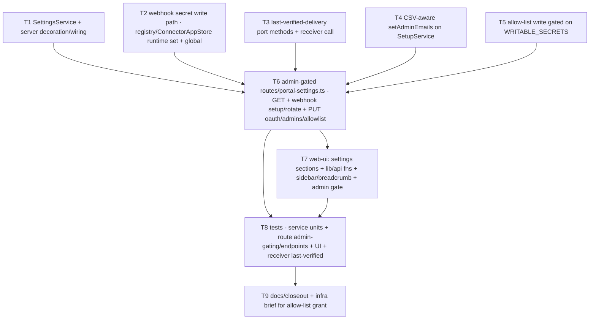

# Admin Portal Settings hub

> Planned via ship-better-plans (brainstorm → 2 discovery passes → tradeoffs →
> specs → DAG). Audit was attempted but misfired on input (audited the Cut A
> receiver instead — which surfaced + fixed two real receiver bugs); this plan
> was NOT re-audited, relying on the grounded discovery instead. Builds on the
> shipped webhook receiver ([github-webhook-receiver](./github-webhook-receiver.md),
> [webhook-receiver-design](../decisions/webhook-receiver-design.md)).

## Goal

Give admins a self-serve **Portal Settings** hub to manage config that today is
only settable at first-boot setup or via gcloud: (1) GitHub webhooks (per-App
secret generate/rotate + setup instructions + delivery health), (2) OAuth login
client, (3) admin emails, (4) login allow-list. Removes the manual
secret-coordination + App-recreate friction for going live with webhooks.

## Success criteria

- An admin can generate/rotate a connector's webhook secret, see the receiver URL
  - the secret + GitHub steps, paste into the App, and watch the status flip to
    "last verified delivery: <ts>" — without touching gcloud or recreating the App.
- OAuth client + admin emails editable post-setup (active mode), admin-gated.
- Allow-list editable once the infra grant lands; ships read-only with a clear
  "pending infra grant" state until then.
- Non-admins get 403 from every settings endpoint (server-enforced; UI hide is
  cosmetic).

## Non-goals

- No new secret-storage mechanism (reuse `connector-apps` blob + GSM writable
  containers).
- No change to webhook _verification_ (receiver already resolves per-App secrets).
- Not migrating session-secret / neo4j-password (bootstrap secrets, not app-writable).

## Decided tradeoffs

| Option                                                                                             | Effort | Risk | Reversibility | Verdict                                                                                                                                             |
| -------------------------------------------------------------------------------------------------- | ------ | ---- | ------------- | --------------------------------------------------------------------------------------------------------------------------------------------------- |
| **A. Backing `SettingsService` (built in index.ts, decorated) + thin `routes/portal-settings.ts`** | Med    | Low  | Easy          | **Chosen** — secret writes + connector-apps mirroring + global-app secret + last-verified reads in one auditable place; routes stay thin + testable |
| B. Decorate raw deps (`secretStore`, `connectorAppStore`) and put logic in handlers                | Low    | Med  | Med           | Scatters secret logic across handlers; leaks store internals; harder to test                                                                        |
| C. Piecemeal — reuse setup routes for active mode + ad-hoc registry methods                        | Low    | High | Hard          | Setup routes are the _inverse_ gate (block active mode); branching gets messy                                                                       |

Secret model (from brainstorming): **per-App secrets in the existing `connector-apps`
blob map** `{connectorId→{…,webhookSecret}}`, generate/rotate **one App at a time**
(no global rotation); receiver unchanged. Portal is the source of truth (generates,
stores, displays).

## Discovery anchors (EXISTS vs NEW)

- **UI:** `(app)/settings/page.tsx` already uses `<Tabs>`; `components/settings/instance-tab.tsx`
  is the admin-scoped template (OIDC editing). Gating idiom `useCurrentUser().role === 'admin'`
  (`lib/current-user.ts`). API via `lib/api.ts` `fetchApi`/`apiFetch`; mutation shape =
  `updateOidcProvider`. NEW: a `Settings` entry in the sidebar Admin group
  (`components/layout/sidebar.tsx` `navGroups`) + `header.tsx` `TRAILS`; per-item
  `adminOnly` filtering; route-level admin guard (none exists today).
- **Backend:** admin assert = `request.ctx.user.role !== 'admin'` → 403 (config-export.ts
  pattern). `SetupService.setOAuthClient` / `setAdminEmail` reusable in active mode
  (NEW routes, not the 409-in-active setup routes). `setAdminEmail` **overwrites a single
  value** → NEW CSV-aware `setAdminEmails(list)`. Webhook secret write = NEW: per-org via
  a registry/ConnectorAppStore method (write sidecar `github-app-<appId>.webhook-secret` +
  re-sync blob); global App via `SecretStore.write('github-webhook-secret')` + set env
  (manifest-service precedent — `GitHubAppService.update` deliberately won't touch it).
  Neither `SecretStore` nor `ConnectorAppStore` is decorated → the `SettingsService` holds
  the refs. Last-verified-delivery = NEW port methods on `WebhookRefetchQueue` reusing its
  redis client. `auth-allow-list-emails` NOT in `WRITABLE_SECRETS` (infra-blocked).

## Functional requirements

1. **Admin gating** — every settings endpoint: `request.ctx.user.role !== 'admin'` → 403
   FORBIDDEN. UI hides sections + nav for non-admins (cosmetic).
2. **Surface** — extend `(app)/settings` `<Tabs>` with admin-only sections (mirror
   `InstanceTab`); add a `Settings` entry to the sidebar Admin group + a `TRAILS`
   breadcrumb; non-admins don't see it.
3. **GitHub Webhooks section** — `GET /api/settings/webhooks` → per-connector
   `{connectorId, appId, org, secretConfigured, lastVerifiedDelivery, webhookUrl}`
   (URL from `connectors.github.app.webhookPublicUrl`); `POST /api/settings/webhooks/:connectorId/(setup|rotate)`
   generates a random secret, persists per-App (per-org → sidecar + `connector-apps` blob
   re-sync; global App → `SecretStore.write('github-webhook-secret')` + env), returns the
   secret + numbered GitHub-App steps to the admin browser.
4. **Last-verified-delivery** — receiver calls NEW `WebhookRefetchPort.recordVerifiedDelivery({connectorId,event,deliveryId,ts})`
   post-verify (Redis key on the dedup client, long/no TTL); `getLastVerifiedDelivery(connectorId)`
   read back by FR3's GET. Absent in Redis-less servers → field is null.
5. **OAuth client** — `PUT /api/settings/oauth` reuses `SetupService.setOAuthClient` in active
   mode; UI confirm dialog; warn on lockout risk. Maps `InvalidOAuthClientError` → 400.
6. **Admin emails** — `PUT /api/settings/admins` edits the full list via NEW CSV-aware
   `setAdminEmails(list)` (writes `auth-admin-emails` + `SHIPIT_AUTH_ADMINS`). Guardrail:
   caller cannot remove their own email (422). `InvalidAdminEmailError` → 400.
7. **Login allow-list** — `GET` always; `PUT /api/settings/allowlist` gated on
   `auth-allow-list-emails ∈ WRITABLE_SECRETS`. Ships **read-only** with a "pending infra
   grant" banner; when the grant lands, add the secret to `WRITABLE_SECRETS` and enable the
   PUT. Guardrail: caller cannot remove their own email (422). See open question
   [allow-list-secret-not-app-writable](../open-questions/allow-list-secret-not-app-writable.md).
8. **`SettingsService`** — constructed in `index.ts` (holds `secretStore`, live
   `config.connectors.github.app`, `connectorRegistry`, `webhookRefetch` port), decorated on
   the server; routes call it. Webhook-secret write goes through it (or a registry method it
   calls) so secret handling lives in one place.
9. **Safety guardrails** — self-lockout prevention on admins/allow-list (422 with a clear
   message); OAuth-client change behind a confirm dialog; webhook secret shown only to
   admins, on demand (source-of-truth model), never logged.

## Non-functional

- Admin-only; secrets never logged; the webhook secret IS returned to the admin browser by
  design (so they can paste it into GitHub). Structured `{error:{code,message}}` envelopes.
- GSM-unavailable / file-mode: webhook-secret rotate degrades gracefully (clear error, no
  crash). Multi-pod: last-verified lives in Redis (not in-memory) so it's consistent.

## Edge cases

- No connectors → empty webhook list. Connector on the shared global App (N:1) → those
  connectors share one secret (stored in `github-webhook-secret`); UI notes it.
- GSM down / file mode → rotate returns a clear 503-style error.
- Allow-list PUT before infra grant → 403/disabled with the pending-grant message.
- Remove-self (admin or allow-list) → 422 blocked.
- Rotate while receiver Redis down → secret still written (GSM/sidecar); last-verified just
  won't update until Redis returns.

## Task DAG

- **Wave 1 (parallel, independent):** T1, T2, T3, T4, T5. **Then** T6 integrates → T7 (UI) →
  T8 tests → T9 docs.
- **Delegation:** each wave-1 piece to a feature agent (worktree-isolated where they'd touch
  shared files); UI as one agent; tests woven per piece + an integration pass via
  ship-reviewed-prs at the end.
- **Verification per phase:** `pnpm -r typecheck` + targeted tests after each task; full suite
  - prettier before handoff; build event-bus before api-server typecheck (known gotcha).

## Risks & mitigations

- **Self-lockout** editing admins/OAuth/allow-list → guardrails (FR9) + confirm dialogs.
- **Secret exposure** (returning the webhook secret to the browser) → admin-only + on-demand,
  never logged; accepted by design (portal is source of truth).
- **Allow-list infra dependency** → ship read-only; PUT disabled until the grant lands.
- **connector-apps blob is GSM-only** → file-mode deployments persist on disk already; rotate
  degrades with a clear message there.

## Related

- [github-webhook-receiver](./github-webhook-receiver.md) — the receiver this manages
- [webhook-receiver-design](../decisions/webhook-receiver-design.md) — secret model + invariants
- [connector-apps-gsm-blob-durability](../decisions/connector-apps-gsm-blob-durability.md) — the secret map
- [gsm-backed-login-allowlist](../decisions/gsm-backed-login-allowlist.md) — allow-list source
- [allow-list-secret-not-app-writable](../open-questions/allow-list-secret-not-app-writable.md) — infra blocker
