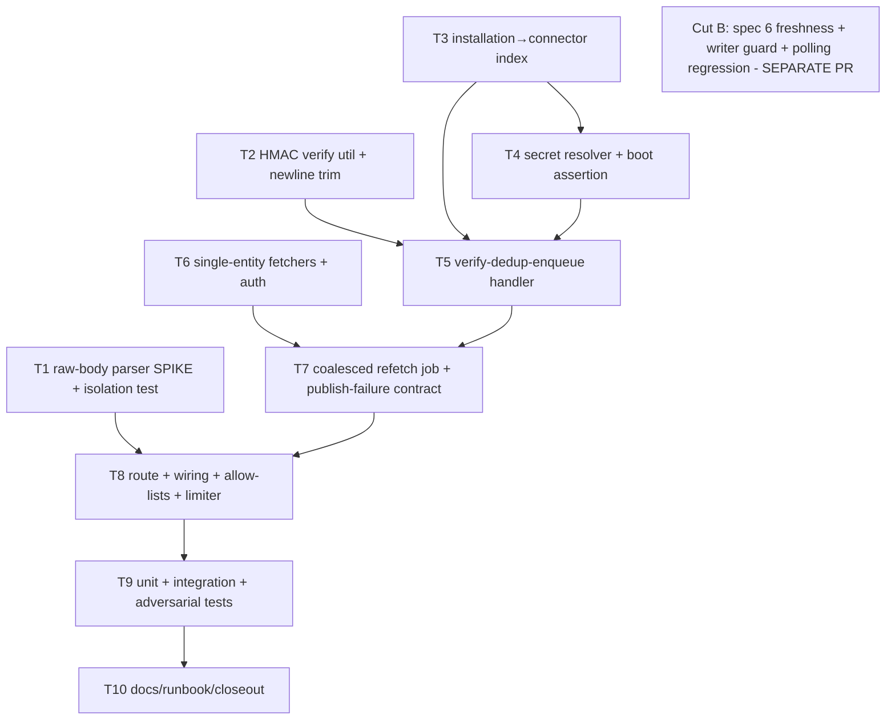

# GitHub Webhook Receiver

> Audited (3-persona: adversarial / pragmatist / production), verdict
> **SHIP_WITH_CHANGES**. All 6 blockers + should-fixes are folded into the specs
> below. Closes the receiver half of
> [per-app-webhook-secrets](../open-questions/per-app-webhook-secrets.md).

## Goal

`POST /api/webhooks/github` that verifies each delivery's HMAC signature against
the **correct App's** webhook secret, dedups the delivery, then enqueues a
**coalesced, async** targeted re-sync that flows the affected entity through the
existing per-entity normalizers → `eventBus.publish` → core-writer pipeline.
Webhooks give freshness; **polling stays as the reconciliation backstop** (and is
the documented data-loss window if the event bus is briefly down).

## Decided tradeoffs

- **Processing model = targeted refetch** (not coarse `triggerSync`, not direct
  payload translation). Webhook → verify → enqueue a debounced job that refetches
  just the affected entity and runs it through the existing pure normalizers
  (`normalizeRepository` / `normalizePipeline`). Downstream is source-agnostic and
  reused unchanged.
- **Secret resolution = per-App sidecar, NO silent global downgrade.** Resolve the
  secret from the per-App store keyed by the resolved App id. The global
  `GITHUB_WEBHOOK_SECRET` is used **only** when a connector genuinely has no
  per-App secret (the shared-App case) — never as a fallback triggered by an
  unknown/forged `installation.id`.

## Security invariants (audit blockers — non-negotiable)

These gate every spec; violating any is a BLOCKER.

- **INV-1 — HMAC first.** The literal first action in the handler is: capture raw
  bytes → resolve secret → HMAC-verify. No event-type parse, index build, `ping`
  shortcut, or any other branch runs before verification. The route is in
  `PUBLIC_PATH_PREFIXES`, so an `ANONYMOUS_PRINCIPAL` is attached and **HMAC is the
  entire auth boundary** (`require-auth.ts:62`).
- **INV-2 — No 2xx before verify, ever.** No `catch` may map a pre-verify exception
  to a 2xx. Any pre-verify 2xx is a full auth bypass.
- **INV-3 — No secret downgrade.** A forged `installation.id` must never select the
  global secret when a per-App secret exists. Unknown installation → `202` + a
  distinct high-severity alert; never global verification.
- **INV-4 — Untrusted selector.** The `installation.id` read to _select_ the secret
  comes from parsing a copy of the unverified body; it is used for routing only and
  is re-validated against the verified payload before any state change. A
  duplicate-key JSON body must not let the selector parse diverge from the dispatch
  parse.
- **INV-5 — Verified deliveries never get 429'd.** Rate limiting must not turn a
  burst of verified redeliveries into a non-2xx storm that makes GitHub auto-disable
  the webhook.

## Scope — two PRs

**Cut A (this deliverable):** specs 1–5, 7 (limited to `push`→repo and
`workflow_run`→workflows), 8, 9, 10. Rides the existing `_event_version: 1`.
`pull_request` and `installation` are accepted, verified, and `202`-logged
(no entity write). This ships a correct, secure receiver.

**Cut B (separate PR, after A):** spec 6 — content-freshness `_event_version`
**plus a core-writer freshness guard** and polling regression tests. Closes the
`last-synced-frozen-by-idempotency-dedup` content-suppression follow-up. Kept out
of A because, on its own, it is unsafe (see spec 6).

## Numbered specs

### 1. Route-scoped raw-body capture _(NEW — spike FIRST, highest estimate risk)_

- No raw-body capture exists anywhere today; a mis-scoped buffer parser breaks JSON
  app-wide. **Spike this first** and prove isolation with an integration test before
  building specs 2–5.
- Webhook routes live in their own encapsulated plugin; inside it,
  `addContentTypeParser('application/json', { parseAs: 'buffer' })` stores
  `req.rawBody` byte-for-byte, then the **same verified bytes** are JSON-parsed
  post-verify. Must not disturb the global JSON parser or the existing `text/yaml`
  string parsers (`server.ts:131-139`).
- Pre-reject: require the three GitHub headers (`x-github-event`,
  `x-github-delivery`, `x-hub-signature-256`) **before** hashing.
- `bodyLimit` ~1–2 MB (tightened from 5 MB). Edges: empty body, oversized push.

### 2. HMAC-SHA256 verify util _(NEW, shared)_

- `verifyGitHubWebhookSignature(rawBody: Buffer, header: string|undefined, secret: string): boolean`
  in `packages/shared/src/auth/github-webhook.ts`. `node:crypto` `createHmac`
  (no existing usage in repo) → `sha256=<hex>` → compare with existing
  `constantTimeEqual` (`token-crypto.ts:47`, length-safe).
- **Hard-401** when `x-hub-signature-256` is absent/malformed, regardless of legacy
  sha1. Fail closed on empty secret.
- **Trim trailing newline** from the secret before HMAC — the sidecar is written
  with a trailing `\n` (`github-app-manifest-service.ts:308`,
  `connector-app-store.ts:171`); untrimmed → every signature 401s.

### 3. `installation.id → connector` index _(NEW, api-server)_

- Built **per-request** from `registry.list()` (small n, always fresh — no
  staleness, no rebuild plumbing). `Map<string, ConnectorInstanceConfig[]>`, numeric
  payload `installation.id` coerced to string. Multiple connectors per installation
  → list; pick enabled. Unknown → empty → caller `202` + alert (INV-3).
- Run the header/rate pre-check (spec 1/8) before this scan.

### 4. Webhook secret resolver _(NEW, api-server, depends 3)_

- `connector → resolveAppCredentials(connector, globalApp) → read sidecar
github-app-<appId>.webhook-secret (trimmed)`. keyDir = `SHIPIT_GITHUB_APP_KEY_DIR`
  or `~/.shipit/keys`.
- **Durability (corrected):** the per-App secret reaches the api-server pod at boot
  via `connectorAppStore.loadAndMaterialize` (`index.ts:209`) writing the sidecar
  from the `connector-apps` GSM blob (`connector-app-store.ts:167-171`) — **not**
  `hydrate.ts`. Add a **boot readiness assertion** that fails loud if a connector
  has an App id but no materialized secret.
- Global env secret used **only** when the connector has no per-App secret (INV-3).
- Distinguish GSM **present** vs **absent-by-design** (manifest stores empty,
  `github-app-manifest-service.ts:294`) vs **should-exist-but-missing** — distinct
  log codes; never masquerade absent-by-design as bad-sig.

### 5. Verify-then-dedup-then-enqueue handler _(NEW — the core)_

Order is fixed (INV-1/2/3/4):

1. Header pre-check; parse a **copy** of raw body for untrusted `installation.id`.
2. Resolve connector(s) via index → resolve secret (spec 4). Unknown id → `202` +
   alert (never global).
3. **HMAC-verify** raw bytes (spec 2). Fail → `401`. If several candidate
   connectors, try each secret until one verifies (rare).
4. Re-parse the **verified** bytes; assert the selector `installation.id` matches.
5. **Dedup `X-GitHub-Delivery`** via Redis `SETNX` short-TTL key (reuse the
   event-bus Redis client). Seen → `202`, no refetch. (Stops one captured signed
   delivery replaying forever into unbounded GitHub calls.)
6. Dispatch by `x-github-event`: `ping`→`200`; `push`/`workflow_run`→enqueue
   coalesced job (spec 7); `pull_request`/`installation`→`202` + log (Cut A);
   unhandled/disabled connector→`202` + log.
7. **Publish/enqueue-failure contract:** transient failure (Redis down/OOM —
   `producer.ts:105/119` rejects; ref 2026-06-17 scar) → **5xx** behind a circuit
   breaker so GitHub redelivers; never 429 (INV-5). Emit a
   `verified_but_publish_failed` counter; polling is the documented max-lag
   recovery path.

### 6. Content-freshness `_event_version` _(NEW — CUT B ONLY, do not ship in A)_

- **Why deferred:** core-writer gates only on exact `isDuplicate` (`writer.ts:98`)
  and `SET`s `_event_version` unconditionally (`queries.ts:25`). A bare version bump
  lets an **older out-of-order delivery overwrite newer state**. It is not monotonic
  on its own.
- Cut B = (a) derive version from source freshness — repos/workflows `updated_at`
  epoch ms; teams/CODEOWNERS (no timestamp) stable content hash; stable for
  unchanged content (no `Date.now()`) — **and** (b) a **writer freshness guard**:
  skip the write when incoming `_event_version` is not greater than stored. Plus
  polling regression tests (unchanged → dedup; changed → write; stale → skip).

### 7. Targeted single-entity fetch _(NEW, github connector)_

- Only list-based `fetchRepositories` / `fetchWorkflows` exist. Add
  `fetchRepository(owner, name)` (+ codeowners) and `fetchRepositoryWorkflows(owner,
name)`. **Confirm** they project the exact shape the `connector.ts` `normalize`
  type-sniffing expects (`full_name` + `default_branch` for repo; etc.).
- Auth reuse is **confirmed**: `authenticateGitHubApp` (`packages/connectors/github/src/auth.ts:35`)
  is callable outside `ConnectorHarness`. The real implementation unknown to verify
  is calling `resolveAppCredentials` at webhook time.
- Runs inside the **coalesced BullMQ job** (debounced, keyed by entity id — **job id
  must not contain `:`**, per the BullMQ-5 scar; use `~` or a hash). Cap concurrency;
  honor GitHub rate-limit headers. `push`→repo+codeowners; `workflow_run`→workflows.

### 8. Route module + wiring + allow-lists _(NEW)_

- `packages/api-server/src/routes/webhooks.ts` (`FastifyPluginAsync`), registered at
  `prefix: '/api/webhooks'` in `server.ts`.
- Add `/api/webhooks/github` (exact) to **`PUBLIC_PATH_PREFIXES`** _and_
  **`SETUP_PUBLIC_PATHS`** (`require-auth.ts:53-60,78-84`) → during first-boot setup
  mode the receiver still `202`s instead of 401-storming GitHub into auto-disable.
- **Rate limiter:** the in-memory per-pod limiter can 429 redelivery bursts (INV-5).
  Either disable rate-limiting on this route (HMAC is the gate) or use a Redis-backed
  limit keyed on `installation_id`.
  - **Resolved 2026-06-20 (PR #76):** Cut A first disabled it (`rateLimit: false`), but
    CodeQL `js/missing-rate-limiting` (high) flags an authorized route with no limit. Switched
    to a deliberately HIGH per-IP ceiling (`{ rateLimit: { max: 1000, timeWindow: '1 minute' } }`)
    — satisfies CodeQL while staying far above any realistic GitHub delivery rate, so INV-5 holds
    in practice (the handler itself still never returns 429; only the plugin could, under abuse).
    A Redis-backed per-`installation_id` limit remains the stronger long-term option.
- **Ingress check:** `matchesAllowList` is exact-equality for non-slash entries
  (`require-auth.ts:131`); one char of `/api` drift = 401 storm (ref single-origin
  `/api`-doubling history). Integration-test **through the Ingress**, not just
  Fastify `inject`.

### 9. Tests

- **Unit:** HMAC (valid/invalid/missing/malformed/empty-secret/**trailing-newline
  secret verifies**), index coerce/multi, secret resolver (per-App vs global-only-
  when-absent), fetch shapers project normalize-expected shape.
- **Integration (`inject`):** bad/missing sig→401, valid `push`→job enqueued / entity
  published, `ping`→200, unknown installation→202+alert, redelivery deduped **before**
  refetch, setup-mode→202, publish-failure→5xx (not 2xx, not 429).
- **Adversarial (required):** forged unknown `installation.id` must **not** verify
  against the global secret when a per-App secret exists; replayed delivery deduped
  before refetch; handler exception → 5xx not 2xx; duplicate-key JSON cannot diverge
  selector vs dispatch parse; `ping` with bad signature → 401.

### 10. Docs / closeout

- Mark [per-app-webhook-secrets](../open-questions/per-app-webhook-secrets.md)
  **answered** (mechanism: peek installation.id → connector → per-App sidecar secret,
  global only when no per-App secret; receiver built).
- Update [github-connector-architecture-v1](../decisions/github-connector-architecture-v1.md)
  consequence (per-App webhook secret resolved at receive time).
- New decision `webhook-receiver-design.md`.
- **Runbook:** webhook-disabled detection + re-enable, secret re-materialization /
  rotation, replay via `event-bus/replay.ts`, polling cadence as the backstop SLA,
  limiter behavior. Reference the 2026-06-17 Redis-OOM scar and the BullMQ colon
  job-id scar.
- smee.io relay note for local-dev delivery (per v1 architecture decision #9).

## Task DAG

- **T1 is spiked first** (parser isolation is the real estimate risk).
- **Wave 1 (parallel):** T1, T2, T3, T6. **Then** T4 (after T3) → T5 (needs T2,T3,T4)
  → T7 (needs T5,T6) → T8 (needs T1,T7) → T9 → T10.
- **Subagent delegation:** T2 (shared crypto) + T6 (connector fetch) + T1 (Fastify
  parser) are independent → parallel. T3+T4 (api-server services) one agent. T5+T7+T8
  (handler + job + route) sequential, one agent. T9 tests one agent. T10 docs.

## Risks & scars referenced

- **Auth bypass** if any pre-verify path returns 2xx (INV-1/2). Mitigated by
  HMAC-first ordering + adversarial tests.
- **Secret downgrade** via forged installation.id (INV-3).
- **Redis-OOM / event-bus down** (2026-06-17 scar) → publish-failure contract
  (5xx + circuit breaker, never 429).
- **BullMQ colon job-id scar** → entity-keyed job ids must avoid `:`.
- **Single-origin `/api`-doubling** → test through Ingress.
- **Spec 6 out-of-order overwrite** → deferred to Cut B with a writer freshness guard.

## Related

- [per-app-webhook-secrets](../open-questions/per-app-webhook-secrets.md) — the question this closes
- [github-connector-architecture-v1](../decisions/github-connector-architecture-v1.md) — webhooks+polling defense-in-depth, smee.io dev
- [connector-apps-gsm-blob-durability](../decisions/connector-apps-gsm-blob-durability.md) — how the per-App secret reaches the pod
- [last-synced-frozen-by-idempotency-dedup](../investigations/last-synced-frozen-by-idempotency-dedup.md) — Cut B content-suppression follow-up
- [redis-memory-limit-below-dataset-oomkills](../scars/redis-memory-limit-below-dataset-oomkills.md) — publish-failure contract rationale
- [bullmq-5-forbids-colons-in-queue-names-and-job-ids](../scars/bullmq-5-forbids-colons-in-queue-names-and-job-ids.md) — job-id constraint
