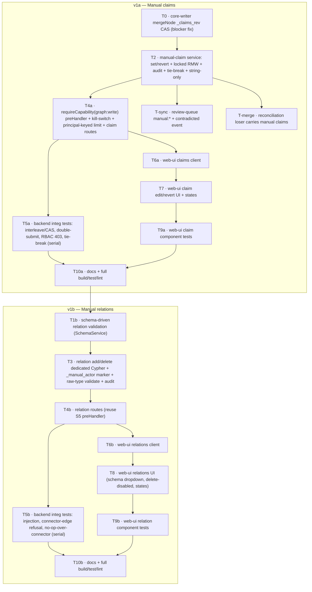

# Manual-edit write path (closes Gap 1 of [[manual-edit-write-path]] open question)

## Goal

Let users edit and enrich the knowledge graph from the webapp: correct a node's
property values, add/remove relationships — and have those manual edits **durably
survive connector re-syncs**. Closes Gap 1 of
`docs/agent/open-questions/manual-edit-write-path.md`. (Gap 2 — source-priority
inconsistency — was already fixed in #74 via the shared `SOURCE_PRIORITY_ORDER`
registry, where `manual` ranks 2nd below `verified`.)

## Approach (Option A — direct writes, audited & sliced)

Direct writes from api-server, extending the **existing `VerificationService` /
`claims.ts` pattern** (locked read-modify-write on a node's `_claims` array via
`loadClaimsLocked` + `_claims_rev`). Manual claims are just another claim type
alongside `verified:`; the `manual` source is already wired into both the writer
and read-path priority registries, so **no registry changes**. Edges use
dedicated manual-edge Cypher (never core-writer's `mergeEdge`).

Chosen over the event-bus path because **Level-3 includes deletes/revert**, which
the upsert-only event-bus pipeline cannot express without inventing tombstones.

**Locked decisions:**

- **Scope:** Level 3 — edit values + add relations + remove/revert.
- **Permissions:** any signed-in user holding the `graph:write` capability
  (default-deny MCP-token principals; reject the anonymous principal).
- **Value type (v1):** string-only. Non-string property targets are rejected
  (400). Schema-typed parsing is a future enhancement.
- **Audit:** every mutation writes an audit event capturing `prior_value` /
  `new_value`, in the same transaction.
- **Delivery:** two shippable cuts behind one architecture — **v1a (claims)**
  then **v1b (relations)**.

## ⚠️ Blocker fixed by this plan: the durability guarantee was false

The audit verified in code that `_claims_rev` does **not** serialize api-server
against core-writer. core-writer's `mergeNode` reads `_claims` in a separate read
tx, then `SET n._claims = <stale snapshot>` in a later write tx, **never reading
or bumping `_claims_rev`**. So a connector resync can silently destroy a manual
claim written between its read and its write (and a revert can be undone). For a
durable-override feature this is a blocker, not background risk.

**Fix (task T0):** make core-writer's `mergeNode` compare-and-set on
`_claims_rev` — read `_claims` + `_claims_rev` in the same write tx and reject/retry
if `_claims_rev` changed, mirroring the existing single-Cypher `_event_version`
guard. This makes both writers honor one lock authority. Covered by an
interleaving integration test (T5a).

Related: [[redis-memory-limit-below-dataset-oomkills]] (unbounded-node incident
class — see audit-bounding below), [[neo4j-no-indexes-declared]] (zero indexes
today), [[codeowner-edge-out-of-order-ordering]] (adjacent edge-ordering risk),
[[integration-tests-sharing-a-db-must-run-serially]] (T5 must run serial).

---

## Specs

### Cross-cutting (both cuts)

- **S5 — Auth, capability, rate limit, kill-switch.** New shared
  `requireCapability('graph:write')` preHandler (today RBAC is inline-duplicated
  as `role !== 'admin'`). It must: reject the anonymous principal
  (`capabilities: []`), **default-deny MCP-token principals** unless the token
  scope explicitly grants `graph:write`, and honor a config kill-switch
  `accessControl.manualWrite.enabled` (default true → `403 FEATURE_DISABLED`).
  Replace the IP-keyed `WRITE_RATE_LIMIT` with a **principal-keyed** limiter
  (`keyGenerator` on `ctx.user.id`/token id, IP fallback); separate human vs
  token budgets; emit a per-principal write-count metric.
- **S6 — Audit.** Each mutation writes an audit event node in the **same
  transaction** as the edit (atomic). Fields: `kind`, `actor`, `target`,
  `prior_value`, `new_value`, `ts`. `prior_value` is computed by invoking the
  **exact read-path resolution function** for that property's configured strategy
  inside the tx (not a naive "highest claim"). Bound growth: a cleanup/retention
  job (mirroring BullMQ retention in `sync-scheduler.ts`) **or** a documented
  deferral with a node-count revisit trigger (zero Neo4j indexes today). Decide
  one node label vs reusing/duplicating `VerificationEvent` (lean: a unified
  `GraphEditEvent { kind }` — record the rationale either way).
- **Error contract.** All routes use the existing `{ error: { code, message } }`
  envelope with deterministic codes for 400/403/404/409/429. Writes return the
  new `_claims_rev` (claims) / created flag (relations) so the client can detect
  lost updates.

### v1a — Manual claim override (claims)

- **S1 — Override a field value.** `POST /api/claims/:entityId/:propertyKey/manual`
  · body `{ value, evidence? }`. Locked read-modify-write reusing
  `loadClaimsLocked` + `_claims_rev`. Writes/replaces the `manual:<actor>`
  `PropertyClaim` (one per property per actor). Confidence =
  `getSourceReliability('manual').reliability` (no new constant). Returns updated
  `ResolvedProperty` + `_claims_rev`.
  - Edge cases: node missing → 404; new property allowed; **non-string value →
    400** (v1 string-only); concurrent connector resync now safe via T0 CAS;
    deterministic tie-break when multiple `manual:<actor>` claims exist on one
    property (define + test — `claims.find` array order is non-deterministic).
- **S2 — Revert/remove a manual claim.**
  `DELETE /api/claims/:entityId/:propertyKey/manual`. Removes the actor's own
  `manual:<actor>` claim (admins may remove any via `?actor=`); effective value
  falls back to the next-ranked claim. No manual claim → idempotent 204. Returns
  updated `ResolvedProperty` + `_claims_rev`.
- **S-sync — Conflict surfacing.** Extend the review-queue contradiction scan
  (`verification-service.ts listReviewQueue`/`resolveReview`) to also match
  `manual:*` (today it only matches `verified:*`), and emit an audit event of
  `kind: contradicted` when a fresh connector value diverges from a manual
  override, so operators distinguish deliberate override from stale drift.
- **S-merge — Reconciliation safety.** Decide + test behavior when a node holding
  manual claims is the identity-reconciliation _loser_ (soft-deleted): migrate
  `manual:*` claims (and re-point audit) to the survivor, or block the merge.
  Otherwise overrides silently vanish post-merge.
- **S7 — UI (claims).** Per-property Edit + Revert affordances in
  `claim-list.tsx` / entity detail, next to the existing Verify. Dialog: value +
  optional evidence. Manual-override badge showing actor. Mutation invalidates
  `['claims', entityId]` (refetch, no optimistic update — match shipped pattern).
  Hide/disable affordances when the principal lacks `graph:write`; friendly
  403/429 toasts.
- **S9a — Shared/client (claims).** `api.ts` gains `setManualClaim` /
  `revertManualClaim` + types + the shared error/response types. No new
  confidence constant.

### v1b — Manual relations

- **S3 — Add a relation.** `POST /api/relations` · body
  `{ from, to, type, properties? }`. Both endpoints must exist (`MATCH`).
  **Validate `type` against the live deployment schema**
  (`SchemaService.getSchema().relationship_types`) with strict equality on the
  **raw** value _before_ `sanitizeLabel` (which mangles, not validates) — never
  sanitize-then-accept; ideally enforce the schema's from/to label constraints.
  Use **dedicated** manual-edge Cypher: `MERGE (from)-[r:TYPE]->(to)
ON CREATE SET r._source='manual:<actor>', r._manual_actor=<actor>, _confidence,
_ingested_at`; `ON MATCH` touches **nothing** when the edge is connector-owned
  (returns `created:false` + a "connector owns this edge" signal for S8). Never
  reuse core-writer `mergeEdge` (its unconditional `SET r += $properties` would
  corrupt connector edges). Returns `{ created }`.
  - Edge cases: missing endpoint → 404; self-loop → 400; type not in schema →
    400; from/to violate schema constraints → 400; pre-existing connector edge →
    no-op (created:false), provenance preserved.
- **S4 — Delete a relation.** `DELETE /api/relations` · `{ from, to, type }`.
  Delete **only** edges bearing the positive provenance marker
  `r._manual_actor IS NOT NULL` (data-backed, not a free-text `STARTS WITH`
  convention); also pin any prefix checks to the exact `'manual:'` colon. Validate
  `type` against the schema before interpolating. Connector edge → 409 (refuse);
  absent → idempotent 204. Hard delete.
- **S8 — UI (relations).** Entity-detail Relationships area: Add-relationship
  dialog reusing `entity-search-box` for the target + a **schema-driven** type
  dropdown (`fetchSchema()`, not a static list). List manual relations with a
  delete affordance; connector edges shown but delete-disabled (tooltip
  explaining a connector owns it). Empty-relations state; permission/429 states.
  Relations query key `['relations', entityId]`, refetch-on-success.
- **S9b — Shared/client (relations).** `api.ts` gains `createRelation` /
  `deleteRelation` + types.

---

## Task DAG

**Parallelism:** within v1a, `T-sync`/`T-merge` run alongside the route/UI chain
once T2 lands; T6a (client) depends on **T4a's contracts**, not just T0. v1b
starts after v1a ships. **Delegation:** T0/T2/T3/T4/T5/T-sync/T-merge → backend
agent; T6–T9 → frontend agent (worktree-isolated if parallel); T10 →
verification. Backend (T2→T4a→T5a) and UI (T6a→T7→T9a) chains run concurrently
after T4a's contract is fixed.

## Verification

- `pnpm turbo typecheck && pnpm turbo test && pnpm turbo lint` green.
- T5a integration tests (real Neo4j+Redis, **`--no-file-parallelism`** per the
  serial-DB scar) must include: the manual-set-vs-core-writer interleave asserting
  the manual claim survives (fails before T0); double-submit asserts exactly one
  audit event; member/token lacking `graph:write` → 403; multi-actor tie-break
  determinism; revert idempotency.
- T5b: relation-type injection (`'OWNS]->(x)//'`, non-allowlisted-sanitizes-to-
  allowlisted) → 400; connector-edge delete → 409; manual add over an existing
  github edge leaves `_source=github` and its properties unchanged.

## Audit provenance

Plan audited 2026-06-24 via a multi-persona Workflow (adversarial / pragmatist /
production-readiness). 22 findings consolidated; 1 blocker (T0), the rest folded
in as the must/should/optional amendments above. Notable accepted reframes:
schema-driven relation validation (dropped the static `RELATION_TYPES` constant),
positive `_manual_actor` provenance marker (dropped the free-text delete guard),
principal-keyed rate limiting, capability-based RBAC with token default-deny, and
the v1a/v1b slice.

## Status

**v1a (manual claims) — IMPLEMENTED + fully verified, uncommitted** on
`release-next` (2026-06-24). v1b (relations) not started.

Tasks done: T0 (core-writer `_claims_rev` CAS + optimistic-retry), T2
(ManualEditService + shared `claim-write-helpers` + deterministic
`pickManualOverride` + `GraphEditEvent` audit), T4a (capability RBAC +
kill-switch + principal-keyed rate limit + routes), T-sync (review-queue
`manual:*` + colon-exact prefixes + deduped `contradicted` events), T-merge
(reconciliation migrates `manual:*`/`verified:*` claims + re-points
`[:EDITS]`/`[:VERIFIES]`), T6a/T7/T9a (web-ui client + Edit/Revert UI + badge +
permission/error states + tests), T5a (9-scenario real-Neo4j integration suite),
T10a (full-repo verify + docs).

Evidence: full-repo `turbo typecheck` 14/14, `turbo test` 14/14 (api-server 467
unit + 9 integration, web-ui 146, core-writer 88), `turbo lint` 0 errors. The
blocker is proven fixed end-to-end (T5a scenario 3: a manual claim survives a
stale connector resync). No flakiness across 3 serial integration runs.

Final vetting: multi-persona review (SE/SC/DA; the infra lens dropped on a
connection error) returned REQUEST_CHANGES with 3 must-fix + 4 should-fix, ALL
addressed — emergent findings the plan-audit couldn't see: (1) reconciliation
mutating routes were privileged by T-merge but ungated → now behind
`requireCapability('graph:write')` + write rate-limit; (2) those routes took a
forgeable `?actor=` → now `actorOf(ctx)`; (3) review-queue used array-order
override vs the deterministic `pickManualOverride` → unified; plus evidence
validation, `contradictionKey` delimiter, `getGraphStats` audit-edge exclusion
(shared `INTERNAL_REL_TYPES`), and not recording idempotency on claims-conflict
exhaustion (+ distinct `claimsConflictSkipped` metric). 5 nits deferred.

### Known gaps / deferred (not v1a blockers)

- **Audit retention:** `GraphEditEvent` growth is unbounded (deferred per S6);
  revisit with a node-count trigger ([[neo4j-no-indexes-declared]]).
- **Unindexed scans:** the reconciliation `[:EDITS]`/`[:VERIFIES]` re-point and
  several manual-edit lookups full-scan (zero Neo4j indexes today).
- **`splitMerge` reversal** does NOT un-migrate claims/audit migrated by T-merge —
  a reversed merge would leave the claim on both nodes. Needs a decision + test
  before relying on merge-reversal with manual edits.
- **T5a scenario 3** copies the core-writer `mergeNode` CAS Cypher verbatim
  (with a source pointer) rather than importing `@shipit-ai/core-writer` into
  api-server — kept to avoid a cross-package dep. Revisit if a literal import is
  preferred.
- v1b (relations: T1b/T3/T4b/T5b/T6b/T8/T9b) remains to build.
